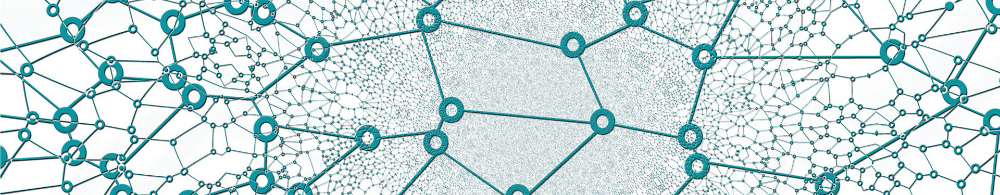

<h4>Hello! My name is Dmitrii. I am a backend developer (and linux enthusiast) with over 5 years of experience (on Python/JavaScript/C/Bash). And also I am an individual validator and node runner. I participated in many testnets and mainnets on Cosmos, Polkadot and others Pos/PoW networks. I work with reliable hardware and have 24/7 monitoring using various tools (such as Grafana and Prometheus, Telegram bots and specific scripts).</h4>

<h3>My mainnets</h3> 
<b>Kujira:</b> <i>https://ping.pub/kujira/staking/kujiravaloper1ghwv3s297fcqqunrfjqlvrjqf27pkwaqk263cs</i> 
<b>Jackal:</b> <i>https://explorer.ppnv.space/jackal/staking/jklvaloper1n0vm5662fk2dzu0hj47hp04q4cmj4jgjt46j8c</i> 
<b>Lambda network:</b> <i>https://explorer.nodestake.top/lambda/staking/lambvaloper1w9pm8d2fn3s53pky0dhlsfngx0dxupk7tml7y7</i> 
<b>Genesis L1:</b> <i>https://ping.pub/genesisl1/staking/genesisvaloper1dmgfmq8f3ls4meguneag394t78ervhp7na9uwp</i> 
<b>Meme:</b> <i>https://ping.pub/meme/staking/memevaloper1hxclfggkuc8s25ps54fceqmlfmxgep4jefvjk9</i> 
<b>Vidulum:</b> <i>https://explorer.erialos.me/vidulum/staking/vdlvaloper13pvsjtk4ehz6cxv8qpsjs7p07pegdm5j2mmerz</i> 
<b>BeeZee:</b> <i>https://explorer.erialos.me/beezee/staking/bzevaloper1xp8kasne7dakz9h07xju73t8vvdjgm039sqqvq</i> 
<b>Humanode:</b> <i>https://telemetry.humanode.io/#list/0xc56fa32442b2dad76f214b3ae07998e4ca09736e4813724bfb0717caae2c8bee</i> 

<h3>Active testnets</h3> 
<b>Nomic:</b> <i>https://testnet.nomic.io/#/staking</i> 
<b>KYVE:</b> <i>https://explorer.kyve.network/korellia/staking/kyvevaloper17axjwh2jd9tatvx42n4v22degd7nma7aquhvpe</i> 
<b>Nibiru:</b> <i>https://texplorer.stavr.tech/nibiru/staking/nibivaloper188suhk9nr0j4vz4h3snwe5u72hk4eeak7vh78f</i> 
<b>Uptick:</b> <i>https://explorer.testnet.uptick.network/uptick-network-testnet/staking/uptickvaloper13qfah88u6kpmwd74hqyjwmk6j062cnfhgtmazr</i> 
<b>Gitopia:</b> <i>https://explorer.stavr.tech/gitopia-testnet/staking/gitopiavaloper1hh56y4lps3wg95a2mfdghff4d9f2dc992nctvy</i> 
<b>Neutron:</b> <i>https://explorer.stavr.tech/neutron-testnet/staking/neutronvaloper1vs2rk7g88apr0tswllh3sz9qmr6ytfqy24aqyp</i> 
<b>Source:</b> <i>https://explorer.stavr.tech/source/staking/sourcevaloper1fyufmdxujjpcez88uwcxlccs0th23sf5m7qhyd</i> 
<b>Ironfish:</b> <i>https://testnet.ironfish.network/users/801</i> 
<b>DWS:</b> <i>https://explore.deweb.services/deweb/staking/dewebvaloper1q4ek4x3ct6jl42ckpnjc7u7a9ggwdjq7ahhwsy</i>  
<b>Nois:</b> <i>https://explorer.stavr.tech/nois/staking/noisvaloper1knljz5pa3uyh7n83e54p6x4u0g3crdjl8qy550</i> 
<b>Empower chain:</b> <i>https://explorer.stavr.tech/empower/staking/empowervaloper1xnwrml7mjnljwpyn0vw57sdwyuyc9xd7vnxj9j</i> 
<b>Joystream:</b> <i>https://telemetry.polkadot.io/#list/0x6b9847d615232517b5c2edf9889610557818f97126339b5beff6763eca55c606</i>  
I also participated in Quicksilver, APTOS, SUI, Quai, Massa, MASA, Obol, Stride, Sei network, Teritori, OKP4, Rebus, Gear, Tgrade, Zeitgeist, Celestia, Ternoa, GAME and other testnets.

<b>Telegram:</b><i> https://t.me/jaha888</i> 
<b>Discord:</b><i> Jaha#9160</i> 
<b>E-mail:</b><i> dmitrii.jaha@gmail.com</i>
